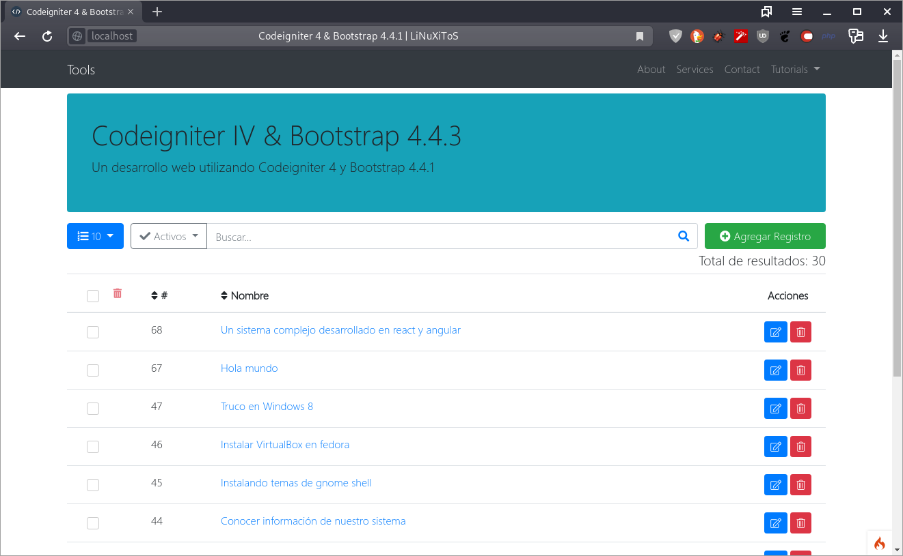
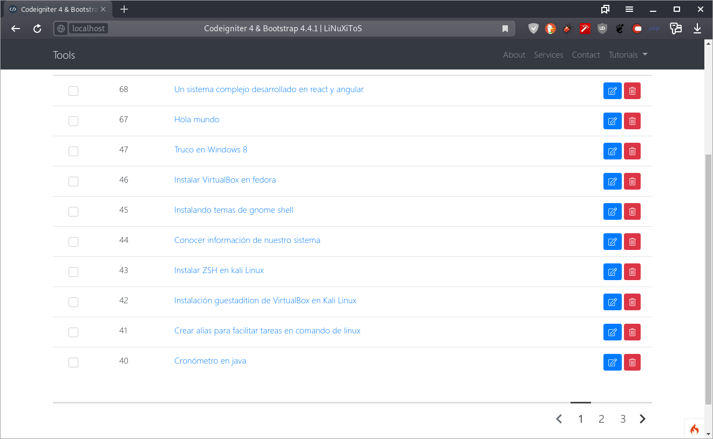
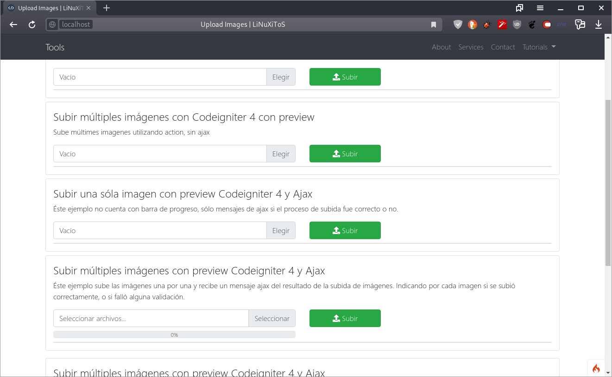

# Paginación en tablas, con ajax y codeigniter

## Descripción

Éstos ejemplos son de mi autoria, son una forma de solucionar los filtrados, busquedas de registros, eliminación, agregar, y sobre todo paginar los registros de tablas usando ajax.  En éste mismo ejemplo, se incluye también la parte de paginación de ajax completo para otras secciones. 

Hay varias opciones para paginar tablas, por ejemplo está jdatatables, sin embargo a veces tarda mucho en cargar, por lo tanto no hay nada mejor que hacer uno propio, pero esa es decisión de cada uno.

Características
================
- Boostrap 4.5.2
- Codeigniter 4.0.2
- Búsqueda en tablas directo a base de datos
- Filtro usando menú desplegable
- Subida de imágenes/archivos al servidor y base de datos
- Scritp de la base de datos

Uso
=====
Visitar https://blog.linuxitos.com/codeigniter-4-con-postgresql

#### Developed By
----------------
 * linuxitos - <contact@linuxitos.com>
